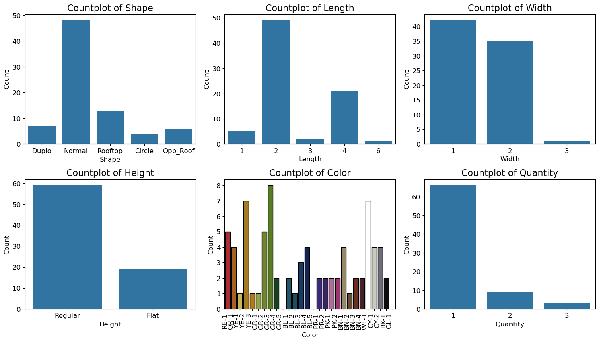
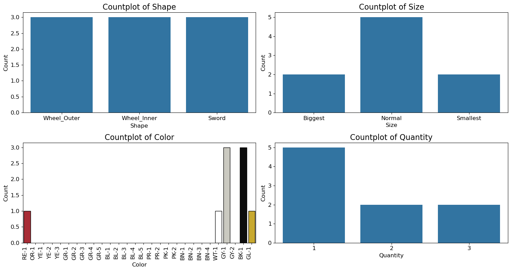

# Lego Report by ASDA Group 4

Initially all objects were divided into “bricks” and “special” objects to avoid a mismatch of classification characteristics. Additionally a color table has been included that references colors across both bricks and special objects for classification. There are a couple key terms to know before diving into the report.  “Studs” is one of these terms. Studs refer to the outward projecting circles on the lego brick. For our purpose of classification, these “Studs” are found on the respective “top” of the lego brick and the direction in which they protrude is called the “height” of the lego brick. Additionally, the base of the brick refers to the “bottom” of the brick.  All other confusion regarding classification will be explained in their respective table section.  

## Table 1: Lego bricks

In Table 1, the bricks and Duplo legos were individually categorized into a table, where each category of block is separated by a specific key.  This key is shown in the first column of table 1 which references all other features of the block (except quantity) ordered as *Shape_Length_Width_Height_Color*. These features are abbreviated in the key, and their meaning will be explained in the following paragraph.

**Table 1.** Lego bricks (preview)

<table border="1" class="dataframe">
  <thead>
    <tr style="text-align: right;">
      <th></th>
      <th>Code</th>
      <th>Shape</th>
      <th>Length</th>
      <th>Width</th>
      <th>Height</th>
      <th>Color</th>
      <th>Quantity</th>
    </tr>
  </thead>
  <tbody>
    <tr>
      <th>0</th>
      <td>D_4_2_R_RE-1</td>
      <td>Duplo</td>
      <td>4</td>
      <td>2</td>
      <td>Regular</td>
      <td>RE-1</td>
      <td>1</td>
    </tr>
    <tr>
      <th>1</th>
      <td>D_4_2_R_GR-3</td>
      <td>Duplo</td>
      <td>4</td>
      <td>2</td>
      <td>Regular</td>
      <td>GR-3</td>
      <td>1</td>
    </tr>
    <tr>
      <th>2</th>
      <td>D_4_2_F_GR-3</td>
      <td>Duplo</td>
      <td>4</td>
      <td>2</td>
      <td>Flat</td>
      <td>GR-3</td>
      <td>1</td>
    </tr>
    <tr>
      <th>3</th>
      <td>D_2_2_R_YE-2</td>
      <td>Duplo</td>
      <td>2</td>
      <td>2</td>
      <td>Regular</td>
      <td>YE-2</td>
      <td>1</td>
    </tr>
    <tr>
      <th>4</th>
      <td>D_2_2_R_PK-2</td>
      <td>Duplo</td>
      <td>2</td>
      <td>2</td>
      <td>Regular</td>
      <td>PK-2</td>
      <td>1</td>
    </tr>
  </tbody>
</table>

Shape refers to the actual design of the brick and if it was Duplo (*Duplo or “D”*), a typical lego brick (*Normal or “N”*), a lego with a slanted edge and a larger base than the top (*Rooftop or “R”*), a lego with a slanted edge and a larger top than the base (*Opp_Roof or “O”*) and circle (*Circle or “C”*) referring to a block with a circular shape. 

From here the dimensions of the blocks were categorized by “studs” for length and width. The respective length and width of the blocks were then categorized in integers, with the Length or “L” referring to the largest dimension of the base and Width or “W” referring to the smallest dimension of the base, to avoid duplication and confusion from discrepancies in Length and  Width from person to person ie.e [L,W] and [W,L]. The Height of the bricks were classified into two categories *Regular or “R”* referring to a regular brick/Duplo height (link) and *Flat or "F"* referring to a height smaller than the regular brick/Duplo height. 

From here the color of the bricks was classified into their respective colors, which is referenced by a code given in table 3 for classification. Quantity refers to the number of bricks with a unique key as shown in column 1.

**Figure 1.** Frequency of observed lego brick features

## Table 2: Special lego items

In alignment with the bricks table, features of the special objects were organized as follows: *Code, Shape, Size, Color and Quantity*.

**Table 2.** Special lego items (preview)

<table border="1" class="dataframe">
  <thead>
    <tr style="text-align: right;">
      <th></th>
      <th>Code</th>
      <th>Shape</th>
      <th>Size</th>
      <th>Color</th>
      <th>Quantity</th>
    </tr>
  </thead>
  <tbody>
    <tr>
      <th>0</th>
      <td>W_B_BK-1</td>
      <td>Wheel_Outer</td>
      <td>Biggest</td>
      <td>BK-1</td>
      <td>2</td>
    </tr>
    <tr>
      <th>1</th>
      <td>W_N_BK-1</td>
      <td>Wheel_Outer</td>
      <td>Normal</td>
      <td>BK-1</td>
      <td>3</td>
    </tr>
    <tr>
      <th>2</th>
      <td>W_S_BK-1</td>
      <td>Wheel_Outer</td>
      <td>Smallest</td>
      <td>BK-1</td>
      <td>1</td>
    </tr>
    <tr>
      <th>3</th>
      <td>W_B_GY-1</td>
      <td>Wheel_Inner</td>
      <td>Biggest</td>
      <td>GY-1</td>
      <td>2</td>
    </tr>
    <tr>
      <th>4</th>
      <td>W_N_GY-1</td>
      <td>Wheel_Inner</td>
      <td>Normal</td>
      <td>GY-1</td>
      <td>3</td>
    </tr>
  </tbody>
</table>

All features conform to the logic established in the bricks table. Three Shapes are identified here: *Wheel_Outer* refers to the outer, rubber part of the wheel. *Wheel_Inner* indicating the inner part of a tire; and *Sword*, which is self-explanatory.

Unlike in the bricks table, where Length, Width, and Height were considered separately, in the Size section, only a single dimension is used: *Biggest or “B”*, *normal or “N”*, and *smallest or “S”*. All sizes are relative to one another for the Wheel parts [*“Wheel_Outer” and “Wheel_Inner”*]. Since there was only one size for the Swords, the sword size was called *“Normal”*.

**Figure 2.** Frequency of observed features of special lego items

## Table 3: Color scheme

Table 3 is used only to understand our method for color classification found in Table 1. This Table is divided into respective columns [*Color Table, Code, Color, Hex Code*]. 

**Table 3**. Color scheme

*Color Table* refers to the name of the color itself, where *Code* refers to the abbreviation system for that color. The column *color* refers to the actual color that people can see with their eyes and is added for the readers of this report. *Hex code* refers to the code that this color is stored at in computer systems for the purpose of standardization, and to compare with other color classification schemes found online.

## Appendix

**Table 1**. Lego bricks

<table border="1" class="dataframe">
  <thead>
    <tr style="text-align: right;">
      <th></th>
      <th>Code</th>
      <th>Shape</th>
      <th>Length</th>
      <th>Width</th>
      <th>Height</th>
      <th>Color</th>
      <th>Quantity</th>
    </tr>
  </thead>
  <tbody>
    <tr>
      <th>0</th>
      <td>D_4_2_R_RE-1</td>
      <td>Duplo</td>
      <td>4</td>
      <td>2</td>
      <td>Regular</td>
      <td>RE-1</td>
      <td>1</td>
    </tr>
    <tr>
      <th>1</th>
      <td>D_4_2_R_GR-3</td>
      <td>Duplo</td>
      <td>4</td>
      <td>2</td>
      <td>Regular</td>
      <td>GR-3</td>
      <td>1</td>
    </tr>
    <tr>
      <th>2</th>
      <td>D_4_2_F_GR-3</td>
      <td>Duplo</td>
      <td>4</td>
      <td>2</td>
      <td>Flat</td>
      <td>GR-3</td>
      <td>1</td>
    </tr>
    <tr>
      <th>3</th>
      <td>D_2_2_R_YE-2</td>
      <td>Duplo</td>
      <td>2</td>
      <td>2</td>
      <td>Regular</td>
      <td>YE-2</td>
      <td>1</td>
    </tr>
    <tr>
      <th>4</th>
      <td>D_2_2_R_PK-2</td>
      <td>Duplo</td>
      <td>2</td>
      <td>2</td>
      <td>Regular</td>
      <td>PK-2</td>
      <td>1</td>
    </tr>
    <tr>
      <th>5</th>
      <td>D_2_2_R_WT-1</td>
      <td>Duplo</td>
      <td>2</td>
      <td>2</td>
      <td>Regular</td>
      <td>WT-1</td>
      <td>1</td>
    </tr>
    <tr>
      <th>6</th>
      <td>D_2_2_R_BL-1</td>
      <td>Duplo</td>
      <td>2</td>
      <td>2</td>
      <td>Regular</td>
      <td>BL-1</td>
      <td>1</td>
    </tr>
    <tr>
      <th>7</th>
      <td>N_2_3_R_YE-2</td>
      <td>Normal</td>
      <td>2</td>
      <td>3</td>
      <td>Regular</td>
      <td>YE-2</td>
      <td>1</td>
    </tr>
    <tr>
      <th>8</th>
      <td>N_2_2_R_YE-2</td>
      <td>Normal</td>
      <td>2</td>
      <td>2</td>
      <td>Regular</td>
      <td>YE-2</td>
      <td>1</td>
    </tr>
    <tr>
      <th>9</th>
      <td>N_2_1_R_YE-2</td>
      <td>Normal</td>
      <td>2</td>
      <td>1</td>
      <td>Regular</td>
      <td>YE-2</td>
      <td>3</td>
    </tr>
    <tr>
      <th>10</th>
      <td>N_4_1_F_YE-2</td>
      <td>Normal</td>
      <td>4</td>
      <td>1</td>
      <td>Flat</td>
      <td>YE-2</td>
      <td>1</td>
    </tr>
    <tr>
      <th>11</th>
      <td>N_4_2_R_OR-1</td>
      <td>Normal</td>
      <td>4</td>
      <td>2</td>
      <td>Regular</td>
      <td>OR-1</td>
      <td>1</td>
    </tr>
    <tr>
      <th>12</th>
      <td>N_3_2_R_OR-1</td>
      <td>Normal</td>
      <td>3</td>
      <td>2</td>
      <td>Regular</td>
      <td>OR-1</td>
      <td>1</td>
    </tr>
    <tr>
      <th>13</th>
      <td>N_2_1_R_OR-1</td>
      <td>Normal</td>
      <td>2</td>
      <td>1</td>
      <td>Regular</td>
      <td>OR-1</td>
      <td>3</td>
    </tr>
    <tr>
      <th>14</th>
      <td>N_2_1_R_BL-1</td>
      <td>Normal</td>
      <td>2</td>
      <td>1</td>
      <td>Regular</td>
      <td>BL-1</td>
      <td>1</td>
    </tr>
    <tr>
      <th>15</th>
      <td>N_4_2_R_PR-2</td>
      <td>Normal</td>
      <td>4</td>
      <td>2</td>
      <td>Regular</td>
      <td>PR-2</td>
      <td>1</td>
    </tr>
    <tr>
      <th>16</th>
      <td>N_4_2_F_PR-1</td>
      <td>Normal</td>
      <td>4</td>
      <td>2</td>
      <td>Flat</td>
      <td>PR-1</td>
      <td>1</td>
    </tr>
    <tr>
      <th>17</th>
      <td>N_4_2_R_PK-1</td>
      <td>Normal</td>
      <td>4</td>
      <td>2</td>
      <td>Regular</td>
      <td>PK-1</td>
      <td>1</td>
    </tr>
    <tr>
      <th>18</th>
      <td>N_2_1_R_PK-1</td>
      <td>Normal</td>
      <td>2</td>
      <td>1</td>
      <td>Regular</td>
      <td>PK-1</td>
      <td>1</td>
    </tr>
    <tr>
      <th>19</th>
      <td>N_2_1_R_PK-2</td>
      <td>Normal</td>
      <td>2</td>
      <td>1</td>
      <td>Regular</td>
      <td>PK-2</td>
      <td>2</td>
    </tr>
    <tr>
      <th>20</th>
      <td>N_6_2_R_BL-4</td>
      <td>Normal</td>
      <td>6</td>
      <td>2</td>
      <td>Regular</td>
      <td>BL-4</td>
      <td>1</td>
    </tr>
    <tr>
      <th>21</th>
      <td>N_4_1_R_BL-4</td>
      <td>Normal</td>
      <td>4</td>
      <td>1</td>
      <td>Regular</td>
      <td>BL-4</td>
      <td>1</td>
    </tr>
    <tr>
      <th>22</th>
      <td>N_2_2_F_BL-4</td>
      <td>Normal</td>
      <td>2</td>
      <td>2</td>
      <td>Flat</td>
      <td>BL-4</td>
      <td>1</td>
    </tr>
    <tr>
      <th>23</th>
      <td>N_4_2_F_WT-1</td>
      <td>Normal</td>
      <td>4</td>
      <td>2</td>
      <td>Flat</td>
      <td>WT-1</td>
      <td>1</td>
    </tr>
    <tr>
      <th>24</th>
      <td>N_4_1_F_WT-1</td>
      <td>Normal</td>
      <td>4</td>
      <td>1</td>
      <td>Flat</td>
      <td>WT-1</td>
      <td>1</td>
    </tr>
    <tr>
      <th>25</th>
      <td>N_2_1_F_WT-1</td>
      <td>Normal</td>
      <td>2</td>
      <td>1</td>
      <td>Flat</td>
      <td>WT-1</td>
      <td>1</td>
    </tr>
    <tr>
      <th>26</th>
      <td>N_2_2_R_WT-1</td>
      <td>Normal</td>
      <td>2</td>
      <td>2</td>
      <td>Regular</td>
      <td>WT-1</td>
      <td>1</td>
    </tr>
    <tr>
      <th>27</th>
      <td>N_4_2_F_BK-1</td>
      <td>Normal</td>
      <td>4</td>
      <td>2</td>
      <td>Flat</td>
      <td>BK-1</td>
      <td>1</td>
    </tr>
    <tr>
      <th>28</th>
      <td>N_4_2_R_GR-3</td>
      <td>Normal</td>
      <td>4</td>
      <td>2</td>
      <td>Regular</td>
      <td>GR-3</td>
      <td>2</td>
    </tr>
    <tr>
      <th>29</th>
      <td>N_2_2_R_GR-3</td>
      <td>Normal</td>
      <td>2</td>
      <td>2</td>
      <td>Regular</td>
      <td>GR-3</td>
      <td>1</td>
    </tr>
    <tr>
      <th>30</th>
      <td>N_2_1_R_GR-3</td>
      <td>Normal</td>
      <td>2</td>
      <td>1</td>
      <td>Regular</td>
      <td>GR-3</td>
      <td>1</td>
    </tr>
    <tr>
      <th>31</th>
      <td>N_4_1_R_GR-2</td>
      <td>Normal</td>
      <td>4</td>
      <td>1</td>
      <td>Regular</td>
      <td>GR-2</td>
      <td>1</td>
    </tr>
    <tr>
      <th>32</th>
      <td>N_2_1_R_GR-2</td>
      <td>Normal</td>
      <td>2</td>
      <td>1</td>
      <td>Regular</td>
      <td>GR-2</td>
      <td>1</td>
    </tr>
    <tr>
      <th>33</th>
      <td>N_4_2_R_GR-2</td>
      <td>Normal</td>
      <td>4</td>
      <td>2</td>
      <td>Regular</td>
      <td>GR-2</td>
      <td>1</td>
    </tr>
    <tr>
      <th>34</th>
      <td>N_2_1_R_BL-3</td>
      <td>Normal</td>
      <td>2</td>
      <td>1</td>
      <td>Regular</td>
      <td>BL-3</td>
      <td>3</td>
    </tr>
    <tr>
      <th>35</th>
      <td>N_2_2_R_BL-3</td>
      <td>Normal</td>
      <td>2</td>
      <td>2</td>
      <td>Regular</td>
      <td>BL-3</td>
      <td>1</td>
    </tr>
    <tr>
      <th>36</th>
      <td>N_4_1_R_BL-3</td>
      <td>Normal</td>
      <td>4</td>
      <td>1</td>
      <td>Regular</td>
      <td>BL-3</td>
      <td>2</td>
    </tr>
    <tr>
      <th>37</th>
      <td>N_4_1_R_BL-2</td>
      <td>Normal</td>
      <td>4</td>
      <td>1</td>
      <td>Regular</td>
      <td>BL-2</td>
      <td>2</td>
    </tr>
    <tr>
      <th>38</th>
      <td>N_1_1_F_BN-3</td>
      <td>Normal</td>
      <td>1</td>
      <td>1</td>
      <td>Flat</td>
      <td>BN-3</td>
      <td>1</td>
    </tr>
    <tr>
      <th>39</th>
      <td>N_2_1_R_GR-1</td>
      <td>Normal</td>
      <td>2</td>
      <td>1</td>
      <td>Regular</td>
      <td>GR-1</td>
      <td>1</td>
    </tr>
    <tr>
      <th>40</th>
      <td>N_2_1_R_GR-4</td>
      <td>Normal</td>
      <td>2</td>
      <td>1</td>
      <td>Regular</td>
      <td>GR-4</td>
      <td>1</td>
    </tr>
    <tr>
      <th>41</th>
      <td>N_2_1_R_BN-3</td>
      <td>Normal</td>
      <td>2</td>
      <td>1</td>
      <td>Regular</td>
      <td>BN-3</td>
      <td>2</td>
    </tr>
    <tr>
      <th>42</th>
      <td>N_2_1_R_BN-4</td>
      <td>Normal</td>
      <td>2</td>
      <td>1</td>
      <td>Regular</td>
      <td>BN-4</td>
      <td>1</td>
    </tr>
    <tr>
      <th>43</th>
      <td>N_2_1_F_BN-4</td>
      <td>Normal</td>
      <td>2</td>
      <td>1</td>
      <td>Flat</td>
      <td>BN-4</td>
      <td>1</td>
    </tr>
    <tr>
      <th>44</th>
      <td>N_2_1_R_YE-3</td>
      <td>Normal</td>
      <td>2</td>
      <td>1</td>
      <td>Regular</td>
      <td>YE-3</td>
      <td>1</td>
    </tr>
    <tr>
      <th>45</th>
      <td>N_2_1_R_YE-1</td>
      <td>Normal</td>
      <td>2</td>
      <td>1</td>
      <td>Regular</td>
      <td>YE-1</td>
      <td>1</td>
    </tr>
    <tr>
      <th>46</th>
      <td>N_2_2_F_RE-1</td>
      <td>Normal</td>
      <td>2</td>
      <td>2</td>
      <td>Flat</td>
      <td>RE-1</td>
      <td>1</td>
    </tr>
    <tr>
      <th>47</th>
      <td>N_2_1_F_RE-1</td>
      <td>Normal</td>
      <td>2</td>
      <td>1</td>
      <td>Flat</td>
      <td>RE-1</td>
      <td>1</td>
    </tr>
    <tr>
      <th>48</th>
      <td>N_2_2_R_GY-1</td>
      <td>Normal</td>
      <td>2</td>
      <td>2</td>
      <td>Regular</td>
      <td>GY-1</td>
      <td>1</td>
    </tr>
    <tr>
      <th>49</th>
      <td>N_2_1_F_GY-1</td>
      <td>Normal</td>
      <td>2</td>
      <td>1</td>
      <td>Flat</td>
      <td>GY-1</td>
      <td>1</td>
    </tr>
    <tr>
      <th>50</th>
      <td>N_4_2_F_GY-2</td>
      <td>Normal</td>
      <td>4</td>
      <td>2</td>
      <td>Flat</td>
      <td>GY-2</td>
      <td>1</td>
    </tr>
    <tr>
      <th>51</th>
      <td>N_4_2_R_GY-2</td>
      <td>Normal</td>
      <td>4</td>
      <td>2</td>
      <td>Regular</td>
      <td>GY-2</td>
      <td>1</td>
    </tr>
    <tr>
      <th>52</th>
      <td>N_4_1_R_BN-1</td>
      <td>Normal</td>
      <td>4</td>
      <td>1</td>
      <td>Regular</td>
      <td>BN-1</td>
      <td>1</td>
    </tr>
    <tr>
      <th>53</th>
      <td>N_2_1_R_BN-1</td>
      <td>Normal</td>
      <td>2</td>
      <td>1</td>
      <td>Regular</td>
      <td>BN-1</td>
      <td>1</td>
    </tr>
    <tr>
      <th>54</th>
      <td>N_3_2_R_BN-1</td>
      <td>Normal</td>
      <td>3</td>
      <td>2</td>
      <td>Regular</td>
      <td>BN-1</td>
      <td>1</td>
    </tr>
    <tr>
      <th>55</th>
      <td>R_4_2_R_RE-1</td>
      <td>Rooftop</td>
      <td>4</td>
      <td>2</td>
      <td>Regular</td>
      <td>RE-1</td>
      <td>2</td>
    </tr>
    <tr>
      <th>56</th>
      <td>R_2_1_R_PR-1</td>
      <td>Rooftop</td>
      <td>2</td>
      <td>1</td>
      <td>Regular</td>
      <td>PR-1</td>
      <td>2</td>
    </tr>
    <tr>
      <th>57</th>
      <td>R_2_2_R_YE-2</td>
      <td>Rooftop</td>
      <td>2</td>
      <td>2</td>
      <td>Regular</td>
      <td>YE-2</td>
      <td>1</td>
    </tr>
    <tr>
      <th>58</th>
      <td>R_2_1_R_GR-3</td>
      <td>Rooftop</td>
      <td>2</td>
      <td>1</td>
      <td>Regular</td>
      <td>GR-3</td>
      <td>1</td>
    </tr>
    <tr>
      <th>59</th>
      <td>R_2_2_R_GR-2</td>
      <td>Rooftop</td>
      <td>2</td>
      <td>2</td>
      <td>Regular</td>
      <td>GR-2</td>
      <td>1</td>
    </tr>
    <tr>
      <th>60</th>
      <td>R_2_1_R_GR-2</td>
      <td>Rooftop</td>
      <td>2</td>
      <td>1</td>
      <td>Regular</td>
      <td>GR-2</td>
      <td>1</td>
    </tr>
    <tr>
      <th>61</th>
      <td>R_2_1_R_GR-3</td>
      <td>Rooftop</td>
      <td>2</td>
      <td>1</td>
      <td>Regular</td>
      <td>GR-3</td>
      <td>1</td>
    </tr>
    <tr>
      <th>62</th>
      <td>R_2_1_F_RE-1</td>
      <td>Rooftop</td>
      <td>2</td>
      <td>1</td>
      <td>Flat</td>
      <td>RE-1</td>
      <td>1</td>
    </tr>
    <tr>
      <th>63</th>
      <td>R_2_1_F_WT-1</td>
      <td>Rooftop</td>
      <td>2</td>
      <td>1</td>
      <td>Flat</td>
      <td>WT-1</td>
      <td>1</td>
    </tr>
    <tr>
      <th>64</th>
      <td>R_2_1_R_BN-1</td>
      <td>Rooftop</td>
      <td>2</td>
      <td>1</td>
      <td>Regular</td>
      <td>BN-1</td>
      <td>2</td>
    </tr>
    <tr>
      <th>65</th>
      <td>R_2_2_R_WT-1</td>
      <td>Rooftop</td>
      <td>2</td>
      <td>2</td>
      <td>Regular</td>
      <td>WT-1</td>
      <td>1</td>
    </tr>
    <tr>
      <th>66</th>
      <td>R_2_1_R_GY-1</td>
      <td>Rooftop</td>
      <td>2</td>
      <td>1</td>
      <td>Regular</td>
      <td>GY-1</td>
      <td>1</td>
    </tr>
    <tr>
      <th>67</th>
      <td>R_2_1_F_BN-2</td>
      <td>Rooftop</td>
      <td>2</td>
      <td>1</td>
      <td>Flat</td>
      <td>BN-2</td>
      <td>1</td>
    </tr>
    <tr>
      <th>68</th>
      <td>C_2_2_F_PR-2</td>
      <td>Circle</td>
      <td>2</td>
      <td>2</td>
      <td>Flat</td>
      <td>PR-2</td>
      <td>1</td>
    </tr>
    <tr>
      <th>69</th>
      <td>C_2_2_F_GY-1</td>
      <td>Circle</td>
      <td>2</td>
      <td>2</td>
      <td>Flat</td>
      <td>GY-1</td>
      <td>1</td>
    </tr>
    <tr>
      <th>70</th>
      <td>C_2_2_R_YE-2</td>
      <td>Circle</td>
      <td>2</td>
      <td>2</td>
      <td>Regular</td>
      <td>YE-2</td>
      <td>1</td>
    </tr>
    <tr>
      <th>71</th>
      <td>C_2_2_R_GR-3</td>
      <td>Circle</td>
      <td>2</td>
      <td>2</td>
      <td>Regular</td>
      <td>GR-3</td>
      <td>1</td>
    </tr>
    <tr>
      <th>72</th>
      <td>O_2_1_R_GY-2</td>
      <td>Opp_Roof</td>
      <td>2</td>
      <td>1</td>
      <td>Regular</td>
      <td>GY-2</td>
      <td>2</td>
    </tr>
    <tr>
      <th>73</th>
      <td>O_1_1_R_GY-2</td>
      <td>Opp_Roof</td>
      <td>1</td>
      <td>1</td>
      <td>Regular</td>
      <td>GY-2</td>
      <td>1</td>
    </tr>
    <tr>
      <th>74</th>
      <td>O_1_1_R_BK-1</td>
      <td>Opp_Roof</td>
      <td>1</td>
      <td>1</td>
      <td>Regular</td>
      <td>BK-1</td>
      <td>1</td>
    </tr>
    <tr>
      <th>75</th>
      <td>O_2_1_R_GR-4</td>
      <td>Opp_Roof</td>
      <td>2</td>
      <td>1</td>
      <td>Regular</td>
      <td>GR-4</td>
      <td>1</td>
    </tr>
    <tr>
      <th>76</th>
      <td>O_1_1_R_BL-4</td>
      <td>Opp_Roof</td>
      <td>1</td>
      <td>1</td>
      <td>Regular</td>
      <td>BL-4</td>
      <td>1</td>
    </tr>
    <tr>
      <th>77</th>
      <td>O_1_1_R_OR-1</td>
      <td>Opp_Roof</td>
      <td>1</td>
      <td>1</td>
      <td>Regular</td>
      <td>OR-1</td>
      <td>1</td>
    </tr>
  </tbody>
</table>

  

**Table 2**. Special lego items

<table border="1" class="dataframe">
  <thead>
    <tr style="text-align: right;">
      <th></th>
      <th>Code</th>
      <th>Shape</th>
      <th>Size</th>
      <th>Color</th>
      <th>Quantity</th>
    </tr>
  </thead>
  <tbody>
    <tr>
      <th>0</th>
      <td>W_B_BK-1</td>
      <td>Wheel_Outer</td>
      <td>Biggest</td>
      <td>BK-1</td>
      <td>2</td>
    </tr>
    <tr>
      <th>1</th>
      <td>W_N_BK-1</td>
      <td>Wheel_Outer</td>
      <td>Normal</td>
      <td>BK-1</td>
      <td>3</td>
    </tr>
    <tr>
      <th>2</th>
      <td>W_S_BK-1</td>
      <td>Wheel_Outer</td>
      <td>Smallest</td>
      <td>BK-1</td>
      <td>1</td>
    </tr>
    <tr>
      <th>3</th>
      <td>W_B_GY-1</td>
      <td>Wheel_Inner</td>
      <td>Biggest</td>
      <td>GY-1</td>
      <td>2</td>
    </tr>
    <tr>
      <th>4</th>
      <td>W_N_GY-1</td>
      <td>Wheel_Inner</td>
      <td>Normal</td>
      <td>GY-1</td>
      <td>3</td>
    </tr>
    <tr>
      <th>5</th>
      <td>W_S_WT-1</td>
      <td>Wheel_Inner</td>
      <td>Smallest</td>
      <td>WT-1</td>
      <td>1</td>
    </tr>
    <tr>
      <th>6</th>
      <td>S_N_RE-1</td>
      <td>Sword</td>
      <td>Normal</td>
      <td>RE-1</td>
      <td>1</td>
    </tr>
    <tr>
      <th>7</th>
      <td>S_N_GY-1</td>
      <td>Sword</td>
      <td>Normal</td>
      <td>GY-1</td>
      <td>1</td>
    </tr>
    <tr>
      <th>8</th>
      <td>S_N_GL-1</td>
      <td>Sword</td>
      <td>Normal</td>
      <td>GL-1</td>
      <td>1</td>
    </tr>
  </tbody>
</table>

